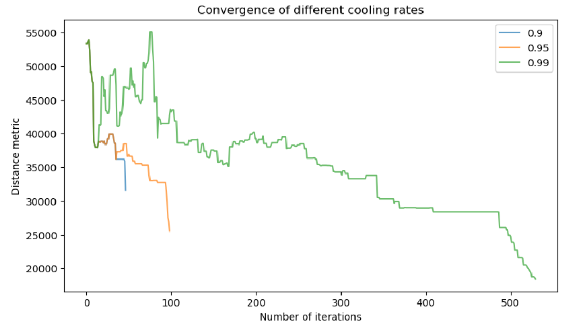

# Assigment 2

> Vyacheslav Sergeev, B19-DS-01

## Description

Assignment consists of 2 parts -- one is theoretical and the other is practical.

Theoretical part can be found in the Assignment2.ipynb (or Assignment2.html if web is more your thing). The rest of the contents of the README are relevant to the practical part only.

## Installation

To run the jupyter notebook simply install the dependencies: `pip install -r requirements.txt`

Beware, you also need to have ffmpeg installed, but you will have to manage that yourself.

## Simulated Annealing algorithm notes

Overall the implementation is quite straighforward and follows from the task description provided. However I have made what can be considered to be an improvement -- I stop the algorithm early if acceptance ratio has turned to none for all pairs of cities (this tends to happen a lot).

I compare my implementation in three different annealing rates: `0.9` (very fast), `0.95` (middle), `0.99` (sluggish). For the comparison purposes all testing is done by fixing the random seed to `42` before producing starting configuration.

## Results

Here are the results:

| Annealing Rate | Number of iterations| Resulting distance |
|:--------------:|:-------------------:|:------------------:|
| 0.9            | 46                  | 36190.48 km        |
| 0.95           | 98                  | 31506 km           |
| 0.99           | 529                 | 19320.11 km        |

Here is the plot that demostrates convergence for all algorithms:

The animations and the individual convergence plots are located in `results` directory.

## My comments on the results
Simulated annealing is pretty cool (pun intended) and it indeed does to some extent "solve" the TSP. However there is no guarantee that we will converge to the best solution and not to a random locl minimum.

Different cooling rates obviously work differently. Since cooling rate practically controls the tradeoff between exploration and exploitation.

Faster cooling allows us to get less iterations and therefore make things faster. However this does come with a hefty tradeoff in performance, or at least it will come with it for bigger tasks.

Slower cooling rate is much better at exploring and does find greener pastures, however it takes a while to do so.

The most surprising thing to me is that when temperature starts to get low all of the cooling rates very quickly decrease distance by exploitation. I would expect this decrease not to be this quick and this drastic.

